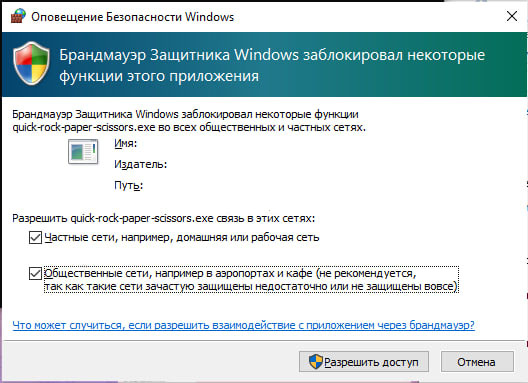
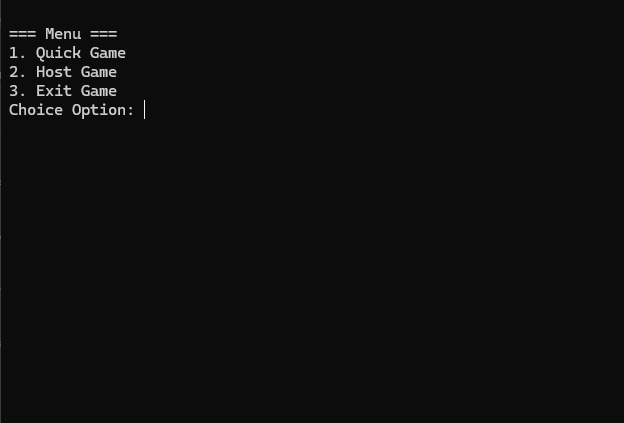
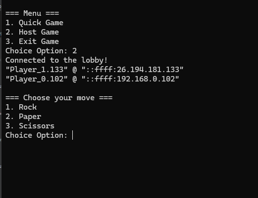
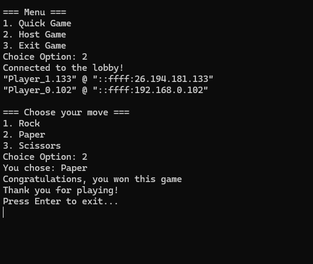

# Rock-Paper-Scissors LAN Game 

## 📌 Project Overview

This project is a **LAN Rock-Paper-Scissors game** built using **Qt** for networking and UI interactions. The game allows players to connect via LAN, join or host game lobbies, and play rounds of Rock-Paper-Scissors against each other.

## ⚙️ Key Design Decisions

### 1️⃣ **Client-Server Architecture**
- The project uses a **server-client model** to manage player connections.
- A **TCP server (`LanTcpServer`)** is responsible for handling connections and player messages.
- **Clients (`LanTcpClient`)** can discover available game lobbies using **UDP broadcasting (`UdpBroadcastListener`)**.

### 2️⃣ **Lobby Management**
- A **server lobby (`ServerLobby`)** handles multiple player connections and ensures fair play.
- Players can **host** their own game session or **join** an existing one.
- The game starts automatically once the **maximum number of players** is reached.

### 3️⃣ **Message Handling and Game Logic**
- Messages between server and clients use **text-based commands** (`/start`, `/choice`, `/win`, `/lose`, `/draw`).
- When both players make their choices, the **server calculates the winner** and sends the result to clients.
- Game logic follows the standard **Rock-Paper-Scissors rules**.

### 4️⃣ **Modular UI Design**
- The game implements a **menu system** using an interface (`IGameActionMenu`), allowing different UI implementations (e.g., console-based or GUI).
- The **main menu (`ConsoleMainMenu`)** provides options for players to host or join a game.
- The **game action menu (`ConsoleGameAction`)** handles user choices and displays game results.

### 5️⃣ **Event-Driven Programming**
- The project utilizes **Qt's signal-slot mechanism** to handle player actions and game events asynchronously.
- Example signals:
  - `playerMadeChoice(int choice)`: Triggered when a player selects Rock, Paper, or Scissors.
  - `invokeGameActionMenu()`: Notifies the UI to display the game menu.
  - `invokeResults(QString result)`: Sends game results to the UI.

## 🛠️ Building and Running the Game

### 🔧 **How to Build**
1. Open **CMakeLists.txt** in **Qt Creator**.
2. Build the project – all required libraries should be loaded automatically.
3. The compiled game will be located in: build\Desktop_Qt_6_8_2_MinGW_64_bit-Release

### ▶️ **How to Run**
1. Open the build directory and launch **`Quick-Rock-Paper-Scissors.exe`**.
2. Run the game on multiple computers within **the same local or virtual network**.

### 🚨 **Important Notes**
- When launching the game, **Windows Firewall** may ask for network access permissions.  
**Allow the game** to use both **private and public networks**, or it won't work.

- **Disable VPN** before playing, as it can interfere with network discovery.  
*(I lost a lot of time figuring this out! 😅)*

---

## 🎮 Game Screenshots

### 📌 **Main Menu**

### 🎭 **Player's Action Selection**

### 🏆 **Game Result**

---

## 🛠️ Technologies Used
- **Qt 5/6**
- **C++**
- **TCP/UDP Networking**
- **Event-driven architecture (Qt Signals & Slots)**